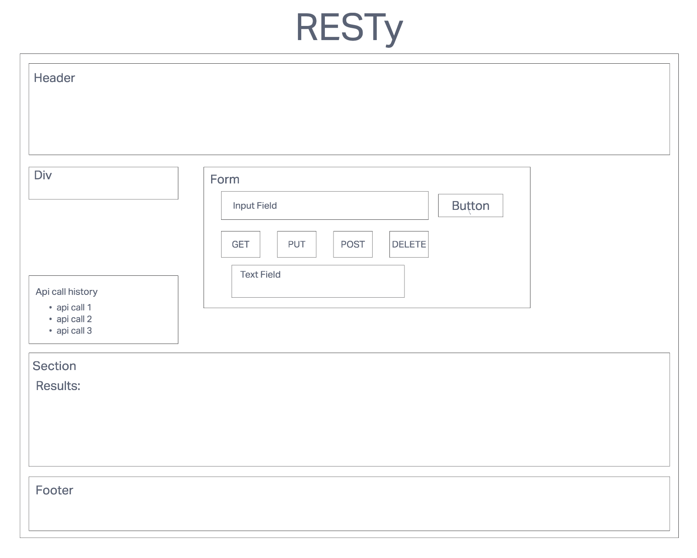

# LAB- Class 26-28

## Project: RESTy

## Author: KC Hofstetter

### Problem Domain

Our application will be an API testing tool that can be run in any browser, allowing a user to easily interact with APIs in a familiar interface. A history section will appear with all previously called API calls, and the user can click on a call and recieve the data that was retrieved when that call was made.

### Business Requirements

Our application will be an API testing tool that can be run in any browser, allowing a user to easily interact with APIs in a familiar interface.

The core requirements and functionality are as follows:

- Simple, intuitive user interface
  - A form where a user:
    - Enters a REST API Endpoint (URI)
    - Selects the REST Method to use (get, post, put, delete)
    - For put and post, allow the user to enter JSON to be used as the body for the request
    - A button to initiate the request
  - A history section which:
    - Shows a list of all unique, successful requests
    - Allows a user to click or select one to re-populate the form so they can repeat the request

### Technical Requirements

- The application will be created with the following overall architecture and methodologies

  - React
  - ES6 Classes
  - Shared Component State
  - Superagent or Axios for performing API Requests
  - SASS for styling
  - Test Driven Development, using Jest
  - Tests will be runnable locally

### Links and Resources

- ci/cd (GitHub Actions)
- back-end server url (when applicable)
- front-end application (when applicable)

### Setup

- How to initialize/run your application (where applicable)
  - npm start

### Tests

- How do you run tests?
  - npm test

### UML

### Deloyed Site

Deployed with Netlify

[View deployed site](https://darling-pie-588a6f.netlify.app/)
